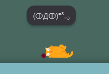
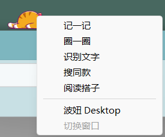
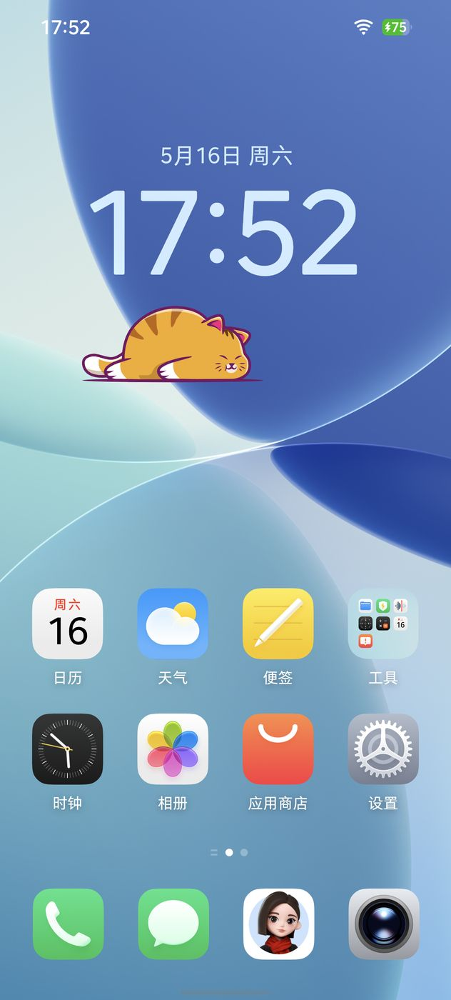
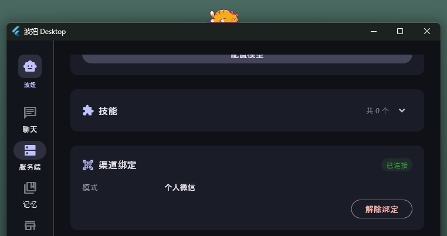
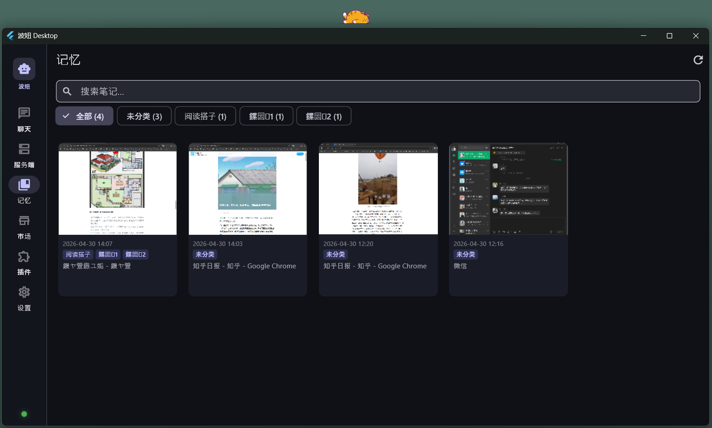

# 🐱 Bonio — 你的 AI 搭子

> 它不是一个聊天窗口，而是一个坐在你窗口边缘的、有灵魂的小家伙。

**Bonio（波妞）** 是一个跨桌面与移动端的 AI 搭子。它是一只浮动在你窗口边缘的虚拟宠物，**看得见你的屏幕，听得见你的声音，记得住你喂给它的东西**——在你需要时默默帮忙，在你无聊时逗你开心。桌面端支持 Windows / macOS，移动端支持 Android / HarmonyOS。


---

## 它跟别的 AI 工具有什么不一样？

| 传统 AI 助手 | Bonio |
|-------------|-------|
| 藏在聊天窗口里，等你去叫它 | 一直趴在窗口边缘，**主动陪着你** |
| 只知道你打的字 | 知道你当前在用哪个应用、浏览器里在看什么 |
| 只能聊天 | 能截图、调窗口布局、控制浏览器、执行脚本 |
| 记不住东西 | 有**记忆系统**，截图/文件/文本拖给它就能自动分类存档 |
| 功能固定 | **插件系统**，任意语言开发，右键菜单无限扩展 |

---

## 怎么玩？

### 🐱 跟它互动

| 动作 | 干什么 |
|------|--------|
| **单击** 猫咪 | 随机动作 + 情绪气泡（打哈欠、伸懒腰、甩尾巴） |
| **双击** 猫咪 | 弹出输入框，跟 AI 聊天 |
| **长按** 猫咪 | 按住说话，松开发送（语音输入） |
| **拖拽** 猫咪 | 手动挪开它 |
| **右键** 猫咪 | 打开功能工具箱 |



它有丰富的表情和动作，不同状态会自动切换：

| 待机 | 倾听 | 思考 |
|:----:|:----:|:----:|
|  |  |  |

| 打字 | 无聊 | 出场 |
|:----:|:----:|:----:|
|  |  |  |

### 🖱️ 右键工具箱

- **记一记** — 截图当前窗口 → AI 自动打标签、写摘要 → 存入记忆
- **圈一圈** — 在窗口上画红框标注 → AI 聚焦分析你圈的区域
- **搜同款** — 圈选商品图片 → 自动淘宝以图搜图
- **伴读** — 浏览器里看长文 → 自动 70/30 分屏，提取目录 + 摘要 + 笔记编辑器



### 📱 移动端

除了桌面端，Bonio 还提供 **Android** 和 **HarmonyOS** 移动客户端，把 AI 搭子带到手机上：

- **浮动猫咪 Avatar**：跟桌面端一样的可爱猫咪，浮在手机屏幕上方
- **语音聊天**：按住说话，AI 实时回复
- **设备能力扩展**：相机拍照、GPS 定位、短信收发、屏幕截图、来电管理
- **服务端工具调用**：AI 可以远程调用手机传感器完成真实世界任务



### 🎤 语音 + 📱 微信

- **按住说话**：长按 Avatar 开始录音，松开发送，本地离线识别
- **微信远程指挥**：通勤路上给 Bonio 发条微信，它会帮你操作电脑



### 🧿 记忆系统

看到想"记住"的东西，**右键一下**，或者**直接拖到猫咪身上**。AI 自动分析、分类、打标签。以后问它："帮我把 #购物 的笔记找出来"——它都能找到。



**笔记导出与同步**：记忆中的笔记可以一键导出到你的主力笔记应用：
- **Obsidian 本地 Vault**：自动生成 Markdown 文件 + YAML Frontmatter + Wiki 链接，支持 `obsidian://` 深度链接直接打开
- **ZIP 归档**：打包为标准 Markdown 格式，附件完整保留
- **自动同步**：开启后新笔记自动导出到 Obsidian，静默无感
- **批量导出**：多选笔记后一次性导出，显示进度和结果
- **同步状态**：笔记卡片显示已同步标识和时间，详情中查看完整同步历史

---

## 架构

Bonio 由四个组件构成，通过统一的 **WebSocket 协议 v3** 通信：

```
┌────────────────────────────────────────────┐
│         Desktop (Flutter)                  │
│  Windows / macOS                           │
│  Avatar · 聊天 · 插件 · 语音 · 记忆         │
└──────────────┬─────────────────────────────┘
               │ WebSocket v3
     ┌─────────┴─────────┐
     ▼                   ▼
┌──────────┐      ┌──────────────┐
│  HiClaw  │      │   OpenClaw   │
│ C++ 自研  │      │ Node.js 社区  │
│ 零依赖部署 │      │ 公共网关      │
└──────────┘      └──────────────┘
     │
     ▼
┌──────────┐  ┌──────────┐
│ Android  │  │HarmonyOS │
│ AI 搭子    │  │ AI 搭子     │
└──────────┘  └──────────┘
```

所有客户端维护**双 WebSocket 会话**：
- **operatorSession**：用户命令（聊天、配置、会话管理）
- **nodeSession**：服务端工具调用（截图、相机、设备控制等）

---

## 快速开始

### 桌面端（推荐）

```bash
# 编译服务端 + 桌面端 + 启动（Windows）
scripts\build-and-run.bat --ninja

# macOS / Linux
scripts/build-and-run.sh

# 只编译桌面端（跳过服务端）
scripts\build-desktop.bat --ninja --run
```

### 前置条件

| 平台 | 需要 |
|------|------|
| **Windows** | Visual Studio Build Tools 2022（命令行工具，非 IDE）+ Ninja |
| **macOS** | Xcode Command Line Tools |
| **Linux** | build-essential + cmake + ninja + libssl-dev |

详见 [CLAUDE.md](CLAUDE.md) 中的完整构建文档。

### 移动端

| 平台 | 构建 |
|------|------|
| **Android** | `cd android && ./gradlew assembleDebug`（需要 Android SDK，minSdk 31） |
| **HarmonyOS** | `cd harmonyos && hvigorw --mode module -p product=default assembleHap`（需要 DevEco Studio SDK） |

移动端连接同一个 HiClaw 后端，共享 AI 对话、会话历史和记忆系统。

### 连接后端

打开主窗口 → Server 标签页 → 填入网关地址。支持两种后端：

| 后端 | 特点 |
|------|------|
| **HiClaw**（自托管） | `./hiclaw gateway` 一键启动，零配置，单文件部署 |
| **OpenClaw**（公共网关） | 连接社区服务，开箱即用 |

---

## 项目结构

| 目录 | 技术栈 | 说明 |
|------|--------|------|
| `desktop/` | Flutter / Dart | Windows & macOS 桌面客户端 |
| `server/` | C++17 / CMake | HiClaw 网关服务器 |
| `android/` | Kotlin / Jetpack Compose | Android AI 搭子 |
| `harmonyos/` | ArkTS | HarmonyOS AI 搭子 |
| `docs/blog/` | — | 技术博客系列（中英双语） |
| `docs/design/` | — | 产品需求文档（PRD） |
| `docs/plans/` | — | 实现计划 |

---

## 了解更多

完整的技术博客系列（10 篇），深入介绍每个子系统：

| # | 文章 |
|---|------|
| 1 | [Bonio 总览：桌面 AI 伴侣的新范式](docs/blog/cn/01-bonio-overview.md) |
| 2 | [Avatar 系统：一个有灵魂的桌面宠物](docs/blog/cn/02-avatar-system.md) |
| 3 | [后端架构：HiClaw 与 OpenClaw 双引擎](docs/blog/cn/03-backend-architecture.md) |
| 4 | [插件系统：Bonio 的无限扩展能力](docs/blog/cn/04-plugin-system-overview.md) |
| 5 | [记一记：碎片化信息的一键收集](docs/blog/cn/05-note-capture.md) |
| 6 | [搜同款：一键比价的购物搭子](docs/blog/cn/06-search-similar.md) |
| 7 | [伴读：把浏览器变成深度学习工具](docs/blog/cn/07-reading-companion.md) |
| 8 | [记忆系统：你的外挂大脑](docs/blog/cn/08-memory-system.md) |
| 9 | [语音交互：从听到说到理解](docs/blog/cn/09-voice-interaction.md) |
| 10 | [微信集成：用手机指挥桌面 AI](docs/blog/cn/10-wechat-integration.md) |

---

## 许可证

MIT
