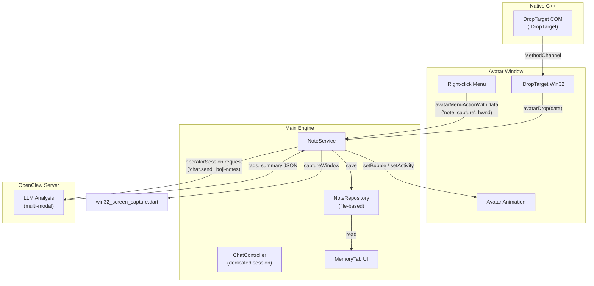

# BoJi 记一记 — 实现计划与架构文档

**日期:** 2026-04-08
**状态:** Phase 1-4 已完成，Phase 5 延后
**关联 PRD:** [boji-desktop-记一记-2026年4月8日.md](boji-desktop-记一记-2026年4月8日.md)

---

## 架构总览



---

## 数据模型

**文件:** `desktop/lib/models/note_models.dart`

```dart
enum NoteType { screenshot, text, image, file }

class BojiNote {
  final String id;           // UUID v4
  final DateTime createdAt;
  final NoteType type;       // screenshot, text, image, file
  final String sourceApp;    // 窗口标题
  final String? rawText;     // 文本内容（拖放文本时）
  final String fileName;     // 附件文件名
  final String? thumbnail;   // 缩略图文件名
  List<String> tags;         // AI 分类标签: ["#购物", "#技术文档"]
  String? summary;           // AI 生成摘要
  bool analyzed;             // AI 是否已处理
}
```

---

## 存储布局

文件存储位于 `{getApplicationSupportDirectory()}/boji-notes/`：

```
boji-notes/
  index.json              # BojiNote 元数据 JSON 数组
  attachments/
    20260408_143025_abc.png
    20260408_150000_def.pdf
  thumbnails/
    20260408_143025_abc_thumb.png
```

- `index.json` 为所有笔记的单一数据源
- 附件以原始格式存储（PNG 截图、拖放文件）
- 缩略图为 200px 宽的 PNG

---

## 修改的文件

| 文件 | 修改内容 |
|------|---------|
| `desktop/lib/avatar_window_app.dart` | 添加"记一记"菜单项（首位）、`_handleNoteCapture()`、`_handleDropEvent()`、`_sendDropToMain()`、`_sendMenuActionToMainWithData()`、`avatarDragEnter`/`avatarDragLeave`/`avatarDrop` MethodChannel 处理 |
| `desktop/lib/providers/app_state.dart` | `_handleNoteCaptureWithData()` 截图保存与 AI 分析、`_handleAvatarDrop()` 拖放内容保存与分析、`avatarMenuActionWithData`/`avatarDrop` MethodChannel 注册 |
| `desktop/lib/services/node_runtime.dart` | 新增 `NoteService` 成员及初始化 |
| `desktop/lib/ui/screens/main_screen.dart` | 新增 Memory 标签页（index 2），Settings 移至 index 4 |
| `desktop/packages/desktop_multi_window/windows/multi_window_manager.cc` | `OleInitialize` + `RegisterDragDrop` 注册、`RevokeDragDrop` 注销 |
| `desktop/packages/desktop_multi_window/windows/flutter_window.h` | `AvatarDropTarget*` 成员声明 |
| `desktop/packages/desktop_multi_window/windows/flutter_window.cc` | `#include "drop_target.h"` |
| `desktop/packages/desktop_multi_window/windows/CMakeLists.txt` | 添加 `drop_target.cpp`，链接 `ole32.lib`、`shell32.lib` |
| `desktop/assets/themes/default-cat/theme.json` | `motionStates` 中添加 `openmouth`、`eating`、`satisfied`、`refuse` 占位映射 |

## 新增文件

| 文件 | 用途 |
|------|------|
| `desktop/lib/models/note_models.dart` | `BojiNote` 数据类、`NoteType` 枚举、JSON 序列化 |
| `desktop/lib/services/note_service.dart` | 截图捕获、文件 CRUD、缩略图生成、AI 分析 |
| `desktop/lib/ui/screens/memory_tab.dart` | Memory 管理页面（搜索、标签过滤、卡片网格、详情对话框） |
| `desktop/packages/desktop_multi_window/windows/drop_target.h` | `AvatarDropTarget` COM 类声明 |
| `desktop/packages/desktop_multi_window/windows/drop_target.cpp` | `IDropTarget` COM 完整实现（CF_HDROP/CF_UNICODETEXT/CF_DIB） |

---

## 分阶段实现详情

### Phase 1: 右键"记一记" — 核心截图 + 本地存储 ✅

**1.1 数据模型 + 存储**
- `note_models.dart`：`BojiNote`、`NoteType` 枚举、`toJson()`/`fromJson()`
- `note_service.dart`：`NoteService extends ChangeNotifier`
  - `init()` — 确保目录结构存在
  - `saveNote(BojiNote, Uint8List?)` — 写入附件文件、更新 `index.json`
  - `deleteNote(id)` — 从索引删除 + 清理文件
  - `captureWindow(hwnd)` — 截图 → PNG → 缩略图 → 存储 → 返回 `BojiNote`
  - `saveDroppedContent(...)` — 保存拖放内容（文本/图片/文件）

**1.2 右键菜单更新**

```dart
items: const [
  {'id': 1, 'label': '记一记', 'enabled': true},    // 第一项
  {'id': 4, 'label': '圈一圈', 'enabled': true},
  {'id': 0, 'label': '', 'enabled': false},          // 分隔线
  {'id': 2, 'label': 'BoJi Desktop', 'enabled': true},
  {'id': 3, 'label': 'Switch Window', 'enabled': false},
],
actions: const {1: 'note_capture', 4: 'ai_lens', 2: 'show_main', 3: 'switch_window'},
```

**1.3 截图流程**

```
用户右键 → "记一记"
  → avatar_window_app: _handleNoteCapture()
    → 获取 _anchoredHwnd
    → _sendMenuActionToMainWithData('note_capture', {hwnd})
  → app_state: _handleNoteCaptureWithData()
    → avatarController.showTemporaryState(happy)
    → avatarController.setBubble('捕捉中...')
    → noteService.captureWindow(hwnd)
      → Win32ScreenCapture.captureWindow(hwnd)
      → toPng() → generateThumbnail()
      → saveNote() → index.json
    → setBubble('捕捉成功！分析中...')
    → noteService.analyzeNote(note)  // 异步
```

---

### Phase 2: AI 分析 — OpenClaw 专用会话 ✅

使用固定 `sessionKey: 'boji-notes'` 隔离笔记分析与用户聊天。

**关键设计决策：** 不切换 `ChatController` 的 session（会中断用户聊天），而是直接通过 `operatorSession.request('chat.send', ...)` 发送 RPC。

```
noteService.analyzeNote(note)
  → 读取附件 PNG
  → base64 编码
  → 构建分析 prompt:
      "[BoJi记一记] 请分析以下内容并返回JSON格式的分类结果。
       来源窗口: {sourceApp}
       请返回如下JSON: {"tags": ["#主题1"], "summary": "一句话摘要"}"
  → operatorSession.request('chat.send', {
      sessionKey: 'boji-notes',
      message: prompt,
      attachments: [{type: 'image', ...}]
    })
  → 解析响应 JSON（带正则回退）
  → 更新 note.tags, note.summary, note.analyzed
  → updateNote() → index.json
  → setBubble('已存入 #tags 喵！')
```

**响应解析策略：**
1. 正则匹配 `{"tags": [...], "summary": "..."}` JSON 块
2. 回退：提取 `#tag` 模式
3. 最终回退：`['#未分类']`

---

### Phase 3: Win32 IDropTarget — 拖放 ✅

**3.1 C++ COM 实现**

`AvatarDropTarget` 类实现 `IDropTarget` COM 接口：

| 方法 | 行为 |
|------|------|
| `DragEnter` | 检测 `CF_HDROP`/`CF_UNICODETEXT`/`CF_DIB`，通知 Dart `avatarDragEnter` |
| `DragOver` | 返回 `DROPEFFECT_COPY` |
| `DragLeave` | 通知 Dart `avatarDragLeave` |
| `Drop` | 提取数据，通知 Dart `avatarDrop` 并附带 `{type, paths/text/base64}` |

**3.2 注册**

在 `multi_window_manager.cc` 的 `Create()` 方法中，子窗口创建后立即注册：

```cpp
OleInitialize(nullptr);
auto* dt = new AvatarDropTarget(sub_hwnd, wrapper);
RegisterDragDrop(sub_hwnd, dt);
```

移除时注销：`RevokeDragDrop(hwnd)`

**3.3 Dart 侧处理**

```dart
case 'avatarDragEnter':
  _cancelWalk();
  setState(() => _localActivityOverride = 'openmouth');

case 'avatarDragLeave':
  setState(() => _localActivityOverride = null);
  _scheduleNextWander();

case 'avatarDrop':
  _handleDropEvent(call.arguments);
  // eating (2s) → satisfied (1s) → idle
  // → _sendDropToMain(data)
```

**3.4 动画映射 (`theme.json`)**

```json
"motionStates": {
  "openmouth": "cat-happy.lottie",
  "eating":    "cat-working.lottie",
  "satisfied": "cat-happy.lottie",
  "refuse":    "cat-angry.lottie"
}
```

---

### Phase 4: Memory 标签页 UI ✅

**4.1 NavigationRail 更新**

主窗口标签顺序：Chat → Server → **Memory** → Market → Settings

**4.2 MemoryTab 设计**

布局结构：
- 顶部：搜索栏 (`TextField`) + 标签过滤芯片 (`FilterChip`)
- 主体：`GridView` 卡片网格（缩略图 + 日期 + 标签 + 摘要）
- 交互：点击查看全图详情（`InteractiveViewer`），长按确认删除

```
+-------------------+
| [thumbnail]       |
| 2026-04-08 14:30  |
| #购物 #背包        |
| "红色背包 淘宝..."  |
+-------------------+
```

**4.3 数据绑定**

`MemoryTab` 监听 `NoteService`（`ChangeNotifier`），搜索/过滤在本地完成。

---

### Phase 5: 对话式调取 ⏳ 延后

`boji-notes` 会话已在 server 端积累分析历史，具备基本上下文记忆。

完整方案需要 server 端改造：
- 方案 A：每次 `chat.send` 时注入最近笔记摘要到系统 prompt
- 方案 B：实现 `notes.search` 服务端 tool，让 LLM 主动查询

---

## 开发进度

| Phase | 范围 | 状态 | 预估工作量 |
|-------|------|------|-----------|
| Phase 1 | 右键截图 + 文件存储 + Avatar 反馈 | ✅ 完成 | 中等 |
| Phase 2 | OpenClaw 专用会话 AI 分析 | ✅ 完成 | 中等 |
| Phase 3 | Win32 IDropTarget + Dart 拖放处理 | ✅ 完成 | 大（原生 C++） |
| Phase 4 | Memory 标签页 UI | ✅ 完成 | 中等 |
| Phase 5 | 对话式调取 | ⏳ 延后 | 需 server 端配合 |
