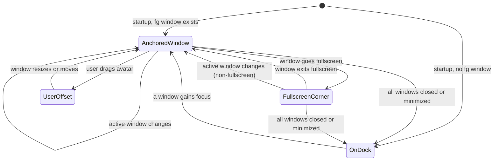
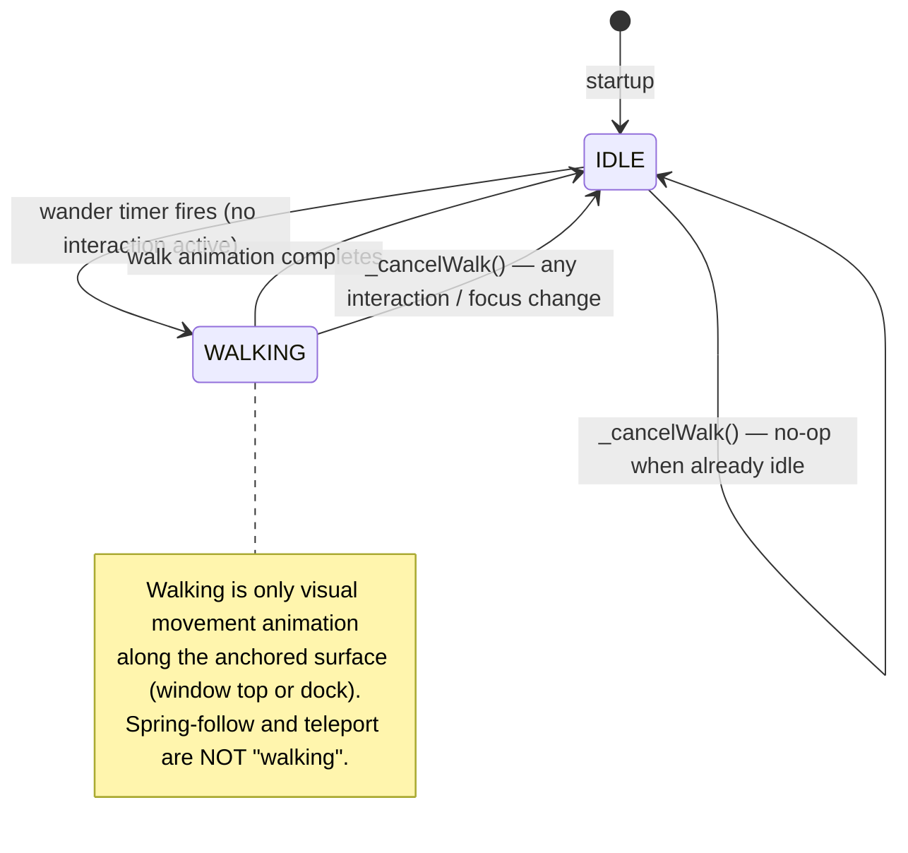

# Desktop Avatar System Design

## Overview

The desktop avatar is a floating cat animation that lives outside the main BoJi window as an independent OS-level window. It provides visual feedback for agent state, voice input, chat streaming, and serves as an always-visible companion anchored to the user's active window.

## Architecture

### Dual-Engine Design

The avatar runs in a **separate Flutter engine** via `desktop_multi_window`, completely independent of the main BoJi window:

```
Main Engine (BoJi window)          Avatar Engine (floating window)
┌──────────────────────┐           ┌──────────────────────┐
│  AppState            │           │  AvatarFloatingApp    │
│  ├─ NodeRuntime      │  sync()   │  ├─ DesktopAvatarView│
│  │  ├─ ChatController│──────────▸│  ├─ WindowListener   │
│  │  ├─ AvatarCtrl    │  (JSON)   │  ├─ Anchor/Dock logic│
│  │  └─ STT Manager   │           │  └─ Spring follow    │
│  └─ TrayService      │           └──────────────────────┘
└──────────────────────┘                WS_POPUP window
                                        transparent, always-on-top
```

**State synchronization**: The main engine serializes `AvatarSnapshot` to JSON and pushes it to the avatar engine via `WindowController.invokeMethod('sync', json)`. The avatar engine is display-only — all state decisions happen in the main engine.

**Reverse communication**: User interactions on the avatar are sent back to the main engine via named methods:
- `avatarVoiceStart` / `avatarVoiceStop` — long-press voice input
- `avatarClick` — single click
- `avatarDoubleClick` — double click (toggle input field)
- `avatarMenuAction` — right-click context menu selection
- `avatarTextSubmit` — text from input field

### Native Window (Windows)

- Created with `WS_POPUP | WS_CLIPCHILDREN` — no title bar, no borders
- Client area = window area (avoids squashing from frame decorations)
- Initial size: 244×156 physical pixels (matches `AvatarSnapshot.kFloatingWindowSize`)
- Dynamically resizes to 244×200 when text input field is shown
- Transparency via `window_manager.setBackgroundColor(Colors.transparent)`
- `setAlwaysOnTop(true)` + `setSkipTaskbar(true)`

### Native Window (macOS)

- Frameless transparent NSWindow
- Level set above normal windows
- Dock info retrieved via custom `getDockInfo` native method

## Avatar States

### Activity States (Lottie animations)

Each state maps to a Lottie JSON animation file in `assets/themes/default-cat/`:

| State | Animation | Trigger |
|-------|-----------|---------|
| `idle` | `cat-idle.json` | Default; no pending runs |
| `listening` | `cat-listening.json` | User long-presses avatar for voice input |
| `thinking` | `cat-thinking.json` | `chat.send` in flight, no tool calls |
| `working` | `cat-working.json` | Tool calls in progress |
| `speaking` | `cat-speaking.json` | TTS reading assistant reply aloud |
| `happy` | `cat-happy.json` | Single click reaction / server command |
| `bored` | `cat-bored.json` | Single click reaction / server command |
| `sleeping` | `cat-sleeping.json` | Server command |
| `confused` | `cat-bored.json` | Single click reaction / server command |
| `angry` | `cat-angry.json` | Single click reaction / server command |
| `watching` | `cat-watching.json` | Single click reaction / server command |

### Motion States

| State | Animation | Trigger |
|-------|-----------|---------|
| `walking` | `cat-walking.json` | Wandering along window top / dock |
| `running` | `cat-running.json` | `moveTo` with mode=run |
| `dragging` | `cat-dragging.json` | User dragging avatar |

### Action States (gestures)

| Action | Animation | Trigger |
|--------|-----------|---------|
| `tapping` | `cat-tapping.json` | Server `performAction` tap/click |
| `swiping` | `cat-swiping.json` | Server `performAction` swipe/scroll |
| `typing` | `cat-typing.json` | Server `performAction` type/input |
| `waiting` | `cat-waiting.json` | Server `performAction` wait |
| `finishing` | `cat-finishing.json` | Server `performAction` finish |
| `launching` | `cat-launching.json` | Server `performAction` launch/open |
| `takingphoto` | `cat-take-photo.json` | Server `performAction` photo |

### State Priority

Resolution order in `DesktopAvatarTheme.lottieAssetFor()`:

1. **Gesture action** (e.g. tapping, swiping) — highest priority
2. **Motion state** (walking, running, dragging)
3. **Activity state** (idle, thinking, speaking, etc.)
4. **Fallback** → `cat-idle.json`

## User Interactions (PRD 3.0)

### Pointer State Machine (floating window)

The floating window uses a raw `Listener` widget (not `GestureDetector`) to disambiguate 5 gestures on the same widget. `GestureDetector` cannot be used because `windowManager.startDragging()` captures the OS pointer, preventing Flutter from seeing `PointerUp`.

```
PointerDown (left button)
  ├─ move > 2px before 300ms → DRAG (windowManager.startDragging)
  ├─ 300ms timer fires (no move) → VOICE START
  │     └─ PointerUp → VOICE STOP + finalize STT
  └─ PointerUp < 300ms → CLICK_PENDING
       ├─ 2nd PointerDown within 400ms → DOUBLE_CLICK
       └─ 400ms timeout → SINGLE_CLICK

PointerDown (right button, bit 0x02)
  └─ CONTEXT MENU (showMenu)
```

### Single Click — Random Animation + Emotion Bubble

1. `avatarClick` → main engine `_handleAvatarClick()`
2. `AvatarController.triggerClickReaction()`:
   - Picks random animation from `[happy, bored, watching, confused, angry]`
   - Picks random kaomoji from a preset list
   - Shows temporary animation via `showTemporaryState()` (2.8s auto-revert)
   - Shows emotion bubble via `setBubble()` (3s auto-clear)

### Double Click — Text Input Field

1. `avatarDoubleClick` → main engine `_handleAvatarDoubleClick()`
2. `AvatarController.toggleInput()` → `showInput` toggled
3. `AvatarSnapshot.showInput` synced to avatar engine
4. Avatar window dynamically resizes (244×156 → 244×200) and shifts upward
5. `TextField` appears below the avatar with send button
6. On Enter: text sent via `avatarTextSubmit` → `chatController.sendMessage()`
7. On Escape or second double-click: input hidden
8. Focus auto-requested when input appears

### Long Press — Voice Input (PTT)

1. Pointer held > 300ms without movement → `avatarVoiceStart`
2. Main engine starts `SherpaOnnxSpeechManager` (streaming ASR)
3. Partial results displayed in bubble above avatar (real-time subtitles)
4. Pointer released → `avatarVoiceStop`
5. Final text extracted from recognizer and sent via `chatController.sendMessage()`

### Right Click — Context Menu

1. Right mouse button detected via `event.buttons & 0x02`
2. `showMenu()` displayed directly in avatar engine at click position
3. Menu items:

| Item | Action | Status |
|------|--------|--------|
| AI Lens | Screen capture + region selection → analyze with AI | Implemented |
| BoJi Desktop | Show main window (`windowManager.show()`) | Implemented |
| Switch Window | Change companion window | Placeholder |
| Rest | Hide avatar (`syncAvatarFloatingWindow(show: false)`) | Implemented |

### Drag — User Offset

- Movement > 2px before long-press threshold → `windowManager.startDragging()`
- Avatar enters `USER_OFFSET` state
- Position offset from window center recorded
- Maintained until anchored window moves/resizes, then resets to center

### Speech Bubble

The bubble appears above the avatar's head, limited to **3 lines max** with auto-scroll:

- `_AutoScrollText` widget: `SingleChildScrollView` + `ClampingScrollPhysics`
- On text update: `animateTo(maxScrollExtent)` — teleprompter effect
- `ConstrainedBox(maxHeight: fontSize * lineHeight * 3 + padding)`
- Content sources:
  - Voice input partial results
  - Streaming assistant text
  - TTS text during playback
  - Click reaction kaomoji
  - Server `avatar.command` setBubble

## Placement State Machine (PRD 3.0)

### States



| State | Description | Wander? |
|-------|-------------|---------|
| `ANCHORED_WINDOW` | Default. Avatar on top edge center of active window. | Yes, along window top edge |
| `FULLSCREEN_CORNER` | Active window is fullscreen; avatar at screen top-right (20px from edge, 8px from top). | No |
| `USER_OFFSET` | User dragged avatar; position maintained relative to window until window geometry changes, then resets to center. | No |
| `ON_DOCK` | No application window to anchor — desktop is the companion target. Avatar sits on taskbar/Dock. | Yes, along taskbar |

### State Variables

```
placementState  : ANCHORED_WINDOW | FULLSCREEN_CORNER | USER_OFFSET | ON_DOCK
anchoredHwnd    : HWND of the window avatar is anchored to (0 when ON_DOCK)
userOffsetX     : X offset from window center (0 = centered, set by drag)
```

### Foreground Window Tracking

**Immediate switching** — no 1-minute delay. When a new foreground window is detected that is:
- Not self (different PID)
- Not fullscreen (< 95% screen coverage)
- Not a tooltip (width and height ≥ 100px)

The avatar immediately teleports to the new window's top edge center.

### Dual-Timer Architecture

**Slow timer (every 3 seconds)** — state transitions & health checks:
```
GetForegroundWindow()         → current foreground HWND
GetWindowRect(foregroundHwnd) → get foreground window position
IsWindow(anchoredHwnd)        → check if anchored window handle is still valid
IsIconic(anchoredHwnd)        → check if anchored window is minimized
GetWindowThreadProcessId()    → exclude self (BoJi process)
```

**Fast timer (every 50ms)** — position tracking, only active while `ANCHORED_WINDOW` or `USER_OFFSET`:
```
GetWindowRect(anchoredHwnd)   → get anchored window position
compare with last known rect  → skip if unchanged
```

### Elastic Spring Following

Instead of snapping directly to the target position, the avatar uses spring-like interpolation for smooth, physical movement when following window drags:

```dart
// 16ms render timer (60fps)
_currentX += (_targetX - _currentX) * 0.12;  // ~200ms settle
_currentY += (_targetY - _currentY) * 0.12;
// Stop when within 0.5px threshold
```

The spring timer starts when the fast tracker detects a position change and stops once the avatar reaches the target within threshold.

### Transition Details

**Startup:**
- Detect foreground window via `GetForegroundWindow()`
- If valid non-self, non-fullscreen window → `ANCHORED_WINDOW`
- If fullscreen → `FULLSCREEN_CORNER`
- If no window / desktop → `ON_DOCK`

**From ANCHORED_WINDOW:**
| Condition | Action |
|-----------|--------|
| Anchored window closed/minimized | Check current foreground: if valid → switch to it; otherwise → ON_DOCK |
| Anchored window goes fullscreen | → FULLSCREEN_CORNER |
| Different foreground window detected | → Switch to new window immediately |
| No foreground window available | → ON_DOCK |
| User drags avatar | → USER_OFFSET (record offset from center) |

**From FULLSCREEN_CORNER:**
| Condition | Action |
|-----------|--------|
| Window exits fullscreen | → ANCHORED_WINDOW |
| New non-fullscreen foreground window | → ANCHORED_WINDOW on new window |
| All windows closed/minimized | → ON_DOCK |

**From USER_OFFSET:**
| Condition | Action |
|-----------|--------|
| Anchored window moves or resizes | → ANCHORED_WINDOW (reset to center) |
| Anchored window closed/minimized | → Same as ANCHORED_WINDOW lost |

**From ON_DOCK:**
| Condition | Action |
|-----------|--------|
| Any non-self, non-fullscreen window gains focus | → ANCHORED_WINDOW |

### Motion State Machine

The avatar's motion is governed by a strict state machine that ensures walking only occurs when the user is completely idle, and every interaction or placement change instantly cancels walking.

#### Motion States



| Motion State | Animation | `_localActivityOverride` | Description |
|---|---|---|---|
| `IDLE` | (none — defers to activity state) | `null` | Default. Avatar plays its activity animation (idle, thinking, etc.) |
| `WALKING` | `cat-walking.json` | `'walking'` | Wandering stroll along anchored surface. `_facingLeft` controls direction. |

#### `_cancelWalk()` — Single Entry Point

All walk cancellation goes through one method:

```dart
void _cancelWalk() {
  _wanderTimer?.cancel();
  _wanderTimer = null;
  _moveAnimTimer?.cancel();
  _moveAnimTimer = null;
  _moveAnimCompleter?.complete();  // unblock awaiting _wander() loop
  _moveAnimCompleter = null;
  _programmaticMove = false;
  _localActivityOverride = null;
  _facingLeft = false;
}
```

#### Callers of `_cancelWalk()`

Every user interaction and every placement transition calls `_cancelWalk()` before proceeding:

| Trigger | Call Site | Effect |
|---|---|---|
| **Single click** | `_sendClickToMain()` | Stop walk → play click reaction animation |
| **Double click** | `_sendDoubleClickToMain()` | Stop walk → show text input field |
| **Long press (voice)** | `_sendVoiceStartToMain()` | Stop walk → start voice input |
| **Right click (menu)** | `_onShowNativeMenu()` | Stop walk → show context menu |
| **Drag** | `onWindowMoved()` | Stop walk → enter USER_OFFSET |
| **Input field shown** | `_handleInputVisibilityChange(visible=true)` | Stop walk → keep avatar still while typing |
| **Focus window change** | `_anchorToWindow()` | Stop walk → teleport to new window |
| **Window lost/closed** | `_transitionToDock()` | Stop walk → teleport to dock |
| **Fullscreen detected** | `_transitionToFullscreenCorner()` | Stop walk → teleport to corner |
| **Anchored window moves** | `_trackAnchoredWindow()` | Stop walk → spring-follow the window |

#### Walk Scheduling Rules

Walking (wandering) only starts when **all** of the following are true:

1. **No interaction active**: `!_menuVisible && !_snapshot.showInput && !_lensActive`
2. **Placement allows wandering**: `ANCHORED_WINDOW` or `ON_DOCK` (not `USER_OFFSET` or `FULLSCREEN_CORNER`)
3. **Wander timer fires**: Random 10–30 second delay after the last wander completed or was cancelled

`_scheduleNextWander()` is called:
- After `_anchorToWindow()` completes (new window anchored, user idle)
- After `_transitionToDock()` completes (fell back to dock, user idle)
- After `_wander()` completes all legs (schedule next stroll)
- After right-click menu closes (if no action taken)
- After input field is dismissed (typing complete)

`_scheduleNextWander()` is **never** called during:
- Any user interaction in progress
- Placement transitions to `FULLSCREEN_CORNER` or `USER_OFFSET`
- Walk animation in progress

#### Multi-Leg Wander Loop

```dart
Future<void> _wander() async {
  // Pre-check: abort if any interaction started since timer was scheduled
  if (!mounted || _interactionActive) return;
  if (placement not in {ANCHORED_WINDOW, ON_DOCK}) return;

  for each leg (2–4 legs):
    // Re-check between legs — interaction may have started
    if (!mounted || _interactionActive || placement changed) break;
    pick random target along surface;
    await _animateWindowTo(target, stroll: true);  // cancellable via _cancelWalk()
    pause 500–1500ms between legs;

  _scheduleNextWander();  // only if still idle
}
```

The `_animateWindowTo` completer is stored as `_moveAnimCompleter` so that `_cancelWalk()` can complete it, unblocking the `await` and allowing the loop to exit immediately.

#### Idle Wandering Parameters

- Random pause interval: 10–30 seconds between strolls (walk:idle ratio ~1:1 to 1:2)
- Multi-leg strolls: 2–4 legs with direction changes and pauses between legs
- Walking speed: ~40px/s (0.04 px/ms) for strolls, ~120px/s for fast moves
- Animated movement with ease-in-out quadratic easing
- Walking animation plays during movement
- Direction awareness: `facingLeft` flips the Lottie horizontally

#### Key Invariants

1. **Walking never blocks interaction**: Any user gesture immediately cancels walking with zero delay.
2. **No walking during focus transitions**: When the user switches to a different window, the avatar teleports — never walks — to the new position.
3. **Walking is purely cosmetic**: It only occurs during extended idle periods. The avatar never walks from window A to window B.
4. **Single source of truth**: `_cancelWalk()` is the only code path that stops walking. No scattered inline cancellation.

## BoJi Lens — 圈一圈 (Window Annotation)

### Overview

BoJi Lens lets users annotate regions on the currently anchored window.  
The entire interaction runs in the **avatar window** — the main BoJi Desktop window is never shown. The avatar window temporarily expands to cover the anchored window, providing a transparent annotation surface with a red border, crosshair cursor, toolbar, and multi-rect annotation support.

### Interaction Flow

0. **Trigger**: User right-clicks the avatar → selects "圈一圈" from the native context menu.
1. The avatar window immediately captures a screenshot of the anchored window via Win32 `PrintWindow`/`BitBlt`.
2. The avatar window expands to cover the anchored window area. A **red border (3px)** appears around the window, indicating the window has been captured and is ready for annotation. Three buttons appear near the avatar: **取消 (Cancel)**, **撤回 (Undo)**, **确认 (Confirm)**.
3. The cursor changes to a **crosshair** (`SystemMouseCursors.precise`), indicating annotation mode.
4. When the user presses and drags the left mouse button, a **red rectangle** is drawn on the window surface, marking the selected region.
5. The user may draw **multiple** annotation rectangles. Each new drag creates a new rectangle.
6. Clicking **确认 (Confirm)** ends annotation mode. The red border disappears, the avatar window shrinks back to normal. The full window screenshot + all annotation rectangles + a structured prompt are sent to the server.
7. Clicking **撤回 (Undo)** removes the most recently drawn annotation rectangle.
8. Clicking **取消 (Cancel)** ends annotation mode without sending anything. The red border disappears and the avatar window restores to normal.

### Win32 Window Capture (dart:ffi)

```
GetWindowRect(hwnd)        → physical rect of the target window
GetDpiForWindow(hwnd)      → DPI scale for physical-to-logical conversion
PrintWindow(hwnd, hdc, 2)  → capture window content (PW_RENDERFULLCONTENT)
GetDIBits                  → extract BGRA pixel data to buffer
GetWindowTextW(hwnd)       → window title for prompt context
```

Uses `PrintWindow` with `PW_RENDERFULLCONTENT` flag to capture the window's rendered content directly, regardless of which monitor it's on or whether it's partially occluded.

### Annotation Overlay (in avatar window)

- Avatar window expands to cover the anchored window rect via `windowManager.setSize` + `wc.setPosition`
- `MouseRegion(cursor: SystemMouseCursors.precise)` for crosshair cursor
- `GestureDetector` captures pan start/update/end for drawing rectangles
- Each rectangle saved as `Rect` in window-relative coordinates
- All saved rectangles rendered as red-bordered, semi-transparent boxes
- Toolbar rendered near the avatar position (top-right area) with Cancel/Undo/Confirm buttons
- The avatar stays visible at its normal anchored position throughout

### Coordinate System

- Annotation coordinates are relative to the anchored window (0,0 at top-left)
- The avatar window is positioned exactly over the anchored window during annotation
- When sending to server, coordinates are in the screenshot's physical pixel space (multiplied by DPI scale)

### Server Prompt Structure

```
[BoJi Lens] 用户在应用窗口 "{windowTitle}" 上进行了圈选标注。

标注区域（像素坐标，相对于窗口左上角）：
1. (x=120, y=340, w=200, h=80)
2. (x=50, y=500, w=300, h=120)

以上标注框是用户手动标注的重点关注区域，请特别关注这些区域的内容，分析并回答用户可能的疑问。
```

The full window screenshot is attached as a PNG image via `OutgoingAttachment`.

## Speech-to-Text (STT)

### Architecture (unified with Android)

```
SpeechToTextManager
  └─ SherpaOnnxSpeechManager (sherpa_onnx FFI)
       └─ Win32Microphone (waveIn API via dart:ffi)
```

- **Sherpa-ONNX**: Local offline streaming ASR, same model as Android
- **Win32Microphone**: Direct `waveIn` API via `dart:ffi` with `CALLBACK_NULL` polling mode
  - No Flutter platform channels (avoids multi-engine `MissingPluginException`)
  - No native-thread callbacks (avoids "Cannot invoke native callback outside an isolate" crash)
  - Polls `WHDR_DONE` flag every 20ms from Dart timer
  - 16kHz mono PCM16, ~100ms buffer chunks

### Text-to-Speech (TTS)

- **Windows**: PowerShell + `System.Speech.Synthesis.SpeechSynthesizer` (SAPI)
- **macOS**: `/usr/bin/say`
- **Linux**: `spd-say` / `espeak-ng` / `espeak`
- No native plugin dependencies — all via `Process.start`

## Window Management

### Main Window

- Minimize → taskbar
- Close button → minimize to system tray (not exit)
- System tray: left-click shows window, right-click menu with "Show" / "Exit"
- "Exit" kills both main window and avatar window

### Avatar Window

- Independent of main window lifecycle (stays visible when main is minimized)
- Only exits when user selects "Exit" from system tray, or "Rest" from right-click menu
- `skipTaskbar: true` — no separate taskbar entry
- `alwaysOnTop: true` — stays above other windows

## File Structure

```
desktop/lib/
├── avatar_window_app.dart          # Avatar engine entry, placement state machine, spring follow
├── models/
│   ├── agent_avatar_models.dart    # Activity/gesture enums
│   └── avatar_snapshot.dart        # Serializable state for cross-engine sync (incl. showInput)
├── services/
│   ├── avatar_controller.dart      # Avatar state management (position, activity, bubble, input toggle, click reactions)
│   ├── avatar_command_executor.dart # Handles server avatar.command events
│   ├── desktop_avatar_theme.dart   # Loads theme.json, maps state→Lottie asset
│   ├── desktop_tts.dart            # Cross-platform TTS (PowerShell/say/espeak)
│   ├── speech_to_text_manager.dart # Unified STT interface
│   └── sherpa_speech_manager.dart  # Sherpa-ONNX streaming ASR
├── platform/
│   ├── win32_microphone.dart       # waveIn FFI microphone capture
│   └── win32_screen_capture.dart   # BitBlt FFI screen capture for AI Lens
├── providers/
│   └── app_state.dart              # App state: handles all avatar inter-engine messages
├── ui/
│   ├── screens/
│   │   ├── ai_lens_screen.dart     # Fullscreen selection overlay for AI Lens
│   │   └── main_screen.dart        # Wires AI Lens callback
│   └── widgets/
│       └── desktop_avatar_overlay.dart # DesktopAvatarView: pointer state machine, context menu, input field
└── assets/themes/default-cat/
    ├── theme.json                  # State→animation mapping + bottomInsets
    └── cat-*.json                  # 34 Lottie animation files

desktop/packages/desktop_multi_window/
└── windows/
    ├── win32_window.cpp            # WS_POPUP window creation
    ├── multi_window_manager.cc     # 244×156 initial size
    └── flutter_window_wrapper.h    # setPosition/getPosition (DPI-aware)
```

## Server-Driven Commands

The server can control the avatar via `avatar.command` events on the operator WebSocket:

| Action | Parameters | Effect |
|--------|-----------|--------|
| `setState` | `{state, temporary?}` | Change activity (with optional auto-revert) |
| `moveTo` | `{x, y, mode?}` | Walk/run to position |
| `setBubble` | `{text, bgColor?, textColor?, countdown?}` | Show speech bubble |
| `clearBubble` | — | Hide speech bubble |
| `tts` | `{text}` | Speak text aloud |
| `stopTts` | — | Stop current TTS |
| `setPosition` | `{x, y}` | Instant teleport |
| `cancelMovement` | — | Stop current movement |
| `performAction` | `{type, x?, y?}` | Play gesture animation at position |
| `setColorFilter` | `{color}` | Tint avatar |
| `sequence` | `{steps[]}` | Execute multiple actions in order |
| `playSound` | `{type}` | System sound (alert/click) |
