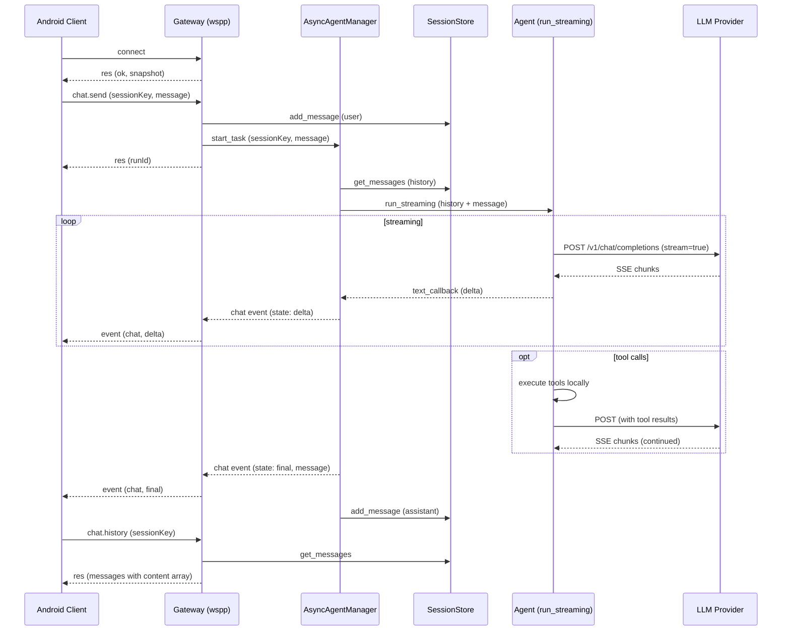

# HiClaw Server Completion Plan

## Current State

The server has most basic infrastructure in place: CLI, config, agent (single-turn + streaming), WebSocket gateway (websocketpp), session store, async agent manager, tool router, and providers (Ollama/OpenAI-compatible). However, several critical gaps prevent it from working correctly end-to-end with the Android client.

## Critical Gaps (Priority Order)

### Gap 1: Agent Does Not Use Chat History (Multi-Turn Broken)

The `run_streaming()` in `server/src/agent/agent.cpp` only sends the current user message. It ignores session history, so every conversation is a fresh single-turn. The `AsyncAgentManager` in `server/src/net/async_agent.cpp` does not pass history from `SessionStore` to the agent.

**Fix:** Add `run_streaming` overload that accepts `std::vector<types::Message>` as conversation history. Wire `AsyncAgentManager.run_task()` to load history from `SessionStore` and pass it to the agent.

### Gap 2: Tool Execution Not Fed Back Into Agent Loop (Streaming)

`run_streaming()` does not execute tools. When the LLM returns tool calls, it emits them via callback and then exits. Unlike `run()` which has a 3-round tool loop, `run_streaming` has no tool loop at all.

**Fix:** Add a tool execution loop to `run_streaming` similar to `run()`: after tool calls are accumulated from the stream, execute them locally, append tool results to the message history, and re-call the provider. This loop should respect an `aborted` flag.

### Gap 3: Chat Event `state: "delta"` Missing

The Android client expects `chat` events with `state: "delta"` containing `message.content` array during streaming. Currently, `AsyncAgentManager` sends `agent` events with `stream: "assistant"` but no `chat` event with `state: "delta"`.

**Fix:** In `AsyncAgentManager.run_task()`, emit `chat` events with `state: "delta"` alongside the `agent` events. The payload should match:

```json
{
  "sessionKey": "...",
  "runId": "...",
  "state": "delta",
  "message": {
    "role": "assistant",
    "content": [{"type": "text", "text": "..."}]
  }
}
```

### Gap 4: `chat.history` Returns Flat String, Client Expects Content Array

The Android client's `parseAssistantDeltaText` expects `message.content` to be an array of `{type, text}` objects. The current `SessionStore` stores `content` as a flat string and `chat.history` returns it as such.

**Fix:** Update `chat.history` response in `server/src/net/gateway.cpp` to wrap text content in the expected array format: `"content": [{"type": "text", "text": "..."}]`.

### Gap 5: `web_fetch` Rejects HTTPS

`server/src/tools/tool.cpp` line 85 rejects `https://` URLs. Most real-world URLs require HTTPS.

**Fix:** Allow HTTPS URLs in `web_fetch`. The underlying `http_client` (libhv) already supports TLS.

### Gap 6: Debug `std::cerr` Output

`server/src/agent/agent.cpp` lines 124-127 and 311-313 print debug info to stderr. These should use `log::debug()` instead.

**Fix:** Replace `std::cerr << "[debug]..."` with `log::debug(...)` calls.

---

## Phase 1: Multi-Turn Chat + Tool Loop (Core Functionality)

### Task 1.1: Add multi-turn `run_streaming` overload

- File: `server/include/hiclaw/agent/agent.hpp` -- add overload accepting `std::vector<types::Message>` history
- File: `server/src/agent/agent.cpp` -- implement: build message array from history + new user message, use existing SSE streaming + tool loop (up to 3 rounds)

### Task 1.2: Wire session history into AsyncAgentManager

- File: `server/include/hiclaw/net/async_agent.hpp` -- add `SessionStore` reference
- File: `server/src/net/async_agent.cpp` -- in `run_task()`, load history from `SessionStore`, call multi-turn `run_streaming`, save assistant response
- File: `server/src/net/gateway.cpp` -- pass `session_store` to `AsyncAgentManager`

### Task 1.3: Add tool execution loop to `run_streaming`

- File: `server/src/agent/agent.cpp` -- after streaming completes and tool calls are accumulated, execute tools locally via `tools::run_tool`, append tool results to messages, re-invoke provider in a loop (up to 3 rounds), streaming each round

---

## Phase 2: Protocol Alignment (Android Client Compatibility)

### Task 2.1: Emit proper `chat` delta events

- File: `server/src/net/async_agent.cpp` -- in the text streaming callback, emit `chat` event with `state: "delta"` and `message.content` array format in addition to the `agent` event

### Task 2.2: Fix `chat.history` content format

- File: `server/src/net/gateway.cpp` -- in `chat.history` response, wrap `m.content` as `[{"type": "text", "text": content}]` array instead of flat string

### Task 2.3: Include `runId` in chat final event message

- File: `server/src/net/async_agent.cpp` -- ensure the `chat` final event includes `message` field with the full response text, so the client can use it as fallback

---

## Phase 3: Bug Fixes and Cleanup

### Task 3.1: Fix `web_fetch` HTTPS rejection

- File: `server/src/tools/tool.cpp` -- change the URL validation to allow `https://` in addition to `http://`

### Task 3.2: Replace debug stderr with log calls

- File: `server/src/agent/agent.cpp` -- replace `std::cerr << "[debug]"` with `log::debug()`

### Task 3.3: Fix Windows path separators

- Files: `server/src/session/store.cpp`, `server/src/memory/file_memory.cpp`, `server/src/cron/store.cpp` -- use `std::filesystem::path` for path joining instead of string concatenation with `"/"`

---

## Phase 4: Future (Not in This Round)

These are documented here but deferred:

- Client-side tool execution via ToolRouter (agent waits for `node.invoke.result`)
- Multimodal message support (images, audio in chat)
- Device capability framework (camera, screen, etc.)
- `sessions.patch`, `sessions.delete`, `sessions.reset`
- `config.apply`, `config.patch`, `config.schema`
- `idempotencyKey` deduplication
- libwebsockets backend feature parity with websocketpp

---

## Architecture Diagram



---

*Created: 2026-03-17*
