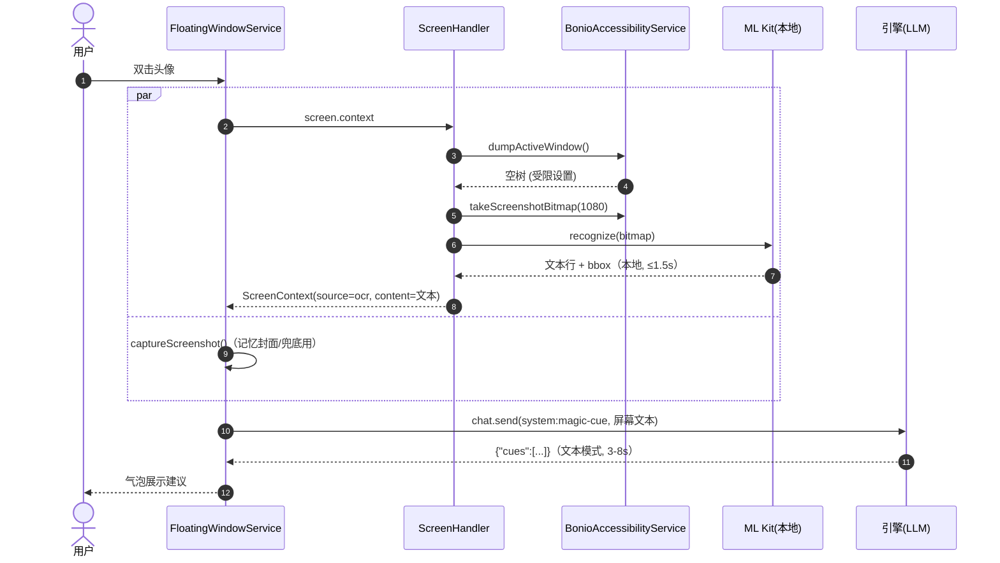

# Arch: 屏幕感知 OCR 降级（Android）

| 文档版本 | 创建日期 | 状态 | 作者 |
| :--- | :--- | :--- | :--- |
| v1.0.0 | 2026-09-18 | 已确认，待实施 | Bonio 团队 |

> PRD：`docs/design/prd/20260918-screen-ocr-degrade-prd.md`
> 参考：桌面端 OCR 方案 `docs/design/arch/20260505-ocr-arch.md`（RapidOCR/PP-OCRv4）

---

## 1. 总体思路

**在生产端降级，下游零改动。**

`screen.context`（`ScreenHandler`）是所有屏幕文本的唯一生产端，消费者（MagicCue、CompanionMemory、LLM 工具路由）只读 `content` 与 `nodes`。当无障碍树为空时，在生产端用本地 OCR 从截图还原出**相同 schema** 的 payload，消费者无需感知降级发生。

```
screen.context 请求
  └─ a11y dumpActiveWindow()
       ├─ content 非空 ──→ 现有路径（source=accessibility）
       └─ content 为空 ──→ 降级链：
             a11y.takeScreenshotBitmap(1080)
               → ScreenOcrRecognizer.recognize(bitmap)   [ML Kit, 本地, ≤5s 超时]
               → nodes: [{text, bounds:"l,t,r,b"}]
               → content: 按 top→left 排序去重（复用 maxTextLength 截断）
               → payload(source="ocr")
             → OCR 失败/超时/空结果 → 维持现有空行为（上层 vision 兜底不变）
```

## 2. OCR 引擎选型

| 方案 | 中文UI精度 | 体积 | 工作量 | GMS 依赖 | 结论 |
|------|-----------|------|--------|----------|------|
| **ML Kit Text Recognition v2 bundled 中文** | 好 | +~25MB | 小（1 个封装类） | 无（bundled 自带模型） | ✅ 选定 |
| RapidOCR ONNX（同桌面 PP-OCRv4） | 好 | +~30MB | 大：onnxruntime + C++ wrapper 移植 + DBNet 后处理 | 无 | 备选 |
| HMS ML Kit | 好 | +~10MB | 中 | 需 HMS Core | ✗（Samsung 无 HMS） |
| Tesseract | 差 | 小 | 中 | 无 | ✗（中文精度不足） |

```kotlin
implementation("com.google.mlkit:text-recognition-chinese:16.0.0")
```

- 行级 bbox 开箱即用（`Text.TextBlock → Text.Line → Text.Element`）；
- 模型随 APK 分发，首次调用加载（~1-2s），后续单次 ~100-500ms；
- 纯端侧推理，图像不出设备。

## 3. 模块设计

### 3.1 新建 `remote/ocr/ScreenOcrRecognizer.kt`

```kotlin
data class OcrLine(val text: String, val left: Int, val top: Int, val right: Int, val bottom: Int)

class ScreenOcrRecognizer {
  private val recognizer by lazy {
    TextRecognition.getClient(ChineseTextRecognizerOptions.Builder().build())
  }

  /** 行级 OCR；整体 5s 超时，失败返回空列表（不抛出）。 */
  suspend fun recognize(bitmap: Bitmap): List<OcrLine> = withContext(Dispatchers.Default) {
    try {
      withTimeout(5_000) {
        val result = recognizer.process(InputImage.fromBitmap(bitmap, 0)).await()
        result.textBlocks.flatMap { it.lines }.map { line ->
          val r = Rect(); line.boundingBox?.let(r::set)
          OcrLine(line.text.trim(), r.left, r.top, r.right, r.bottom)
        }.filter { it.text.isNotEmpty() }
      }
    } catch (e: Throwable) {
      AppLogger.w("ScreenOcr", "ocr failed: ${e.message}")
      emptyList()
    } finally { bitmap.recycle() }
  }
}
```

### 3.2 `BonioAccessibilityService` 增强

新增 `takeScreenshotBitmap(maxEdge, quality): Bitmap?`——与现有 `takeScreenshotBase64` 共用 `takeScreenshot()` 调用，直接返回缩放后的 Bitmap，省去 base64 编解码往返（OCR 输入无需 JPEG 中转）。

### 3.3 `ScreenHandler.handleScreenContext` 降级链（核心改动）

```kotlin
val dump = a11y.dumpActiveWindow(...) ?: return error(...)
val nodes = JSONObject(dump).optJSONArray("nodes")
val a11yLines = parseLines(nodes)                       // 现有逻辑
if (a11yLines.isEmpty()) {
    // ── OCR 降级 ──
    val bitmap = a11y.takeScreenshotBitmap(maxEdge = 1080)
    if (bitmap != null) {
        val ocrLines = ScreenOcrRecognizer().recognize(bitmap)
        if (ocrLines.isNotEmpty()) {
            return buildContextPayload(
                source = "ocr",
                package = dumpPkg, title = dumpTitle,
                lines = ocrLines.map { Line(it.text, it.top, it.left) },
                nodes = ocrLines.toJsonNodes(),          // bounds:"l,t,r,b" 与 a11y 同格式
                maxTextLength = maxTextLength,
            )
        }
    }
    // OCR 失败/空 → 落到现有空 payload 行为
}
// 现有 a11y 路径（source=accessibility）
```

**payload schema（两种 source 完全一致）**：

```json
{
  "source": "accessibility | ocr",
  "package": "com.tencent.mm",
  "title": "微信",
  "content": "行文本（top→left 排序去重，无坐标）",
  "truncated": false,
  "nodes": [ { "text": "...", "bounds": "951,1830,1080,1870" } ]
}
```

- `content` 生成逻辑复用现有实现（排序 + 去重 + maxTextLength 截断）；
- bbox 仅存在于 `nodes`，与无障碍节点格式完全一致，为 cue 注入/点击自动化预留。

### 3.4 下游消费者——零改动

| 消费者 | 变化 |
|--------|------|
| MagicCueController | 无。`vision = !hasText` 自动回到文本模式（文本模式 3-8s，消除 30s 超时） |
| CompanionMemoryController | 无。`screen.content` 直接有文本，记忆内容变完整 |
| LLM `screen.context` 工具 | 无。文本直接可用，省 token |
| FloatingWindowService.runMagicCue | 无。截图仍并行捕获（供记忆 coverImage 与最终视觉兜底） |

## 4. 时序（微信双击，受限设置场景）



## 5. 边界与降级矩阵

| 场景 | 行为 |
|------|------|
| a11y 有文本 | 现状不变，零开销 |
| a11y 空 + 截图可用 + OCR 有结果 | `source=ocr`，文本模式 |
| a11y 空 + OCR 失败/超时(5s)/空结果 | 空文本返回 → MagicCue/Companion 走现有视觉兜底 |
| a11y 服务未启用 | 现有 `ACCESSIBILITY_NOT_ENABLED` 错误不变（不截图降级，保持语义） |
| OCR 首次调用模型加载慢 | 5s 超时兜底，失败回退视觉模式 |

## 6. 文件改动清单

| 文件 | 改动 |
|------|------|
| `android/app/build.gradle.kts` | +1 行 ML Kit 依赖 |
| `android/app/src/main/java/ai/axiomaster/bonio/remote/ocr/ScreenOcrRecognizer.kt` | 新建 |
| `android/app/src/main/java/ai/axiomaster/bonio/remote/node/BonioAccessibilityService.kt` | +`takeScreenshotBitmap()` |
| `android/app/src/main/java/ai/axiomaster/bonio/remote/node/ScreenHandler.kt` | 降级链 + source 标记 |

## 7. 测试计划

1. **受限设置设备（MLN-L29, Android 16）**：微信双击 → 日志 `screen.context source=ocr content_len>0` → cue 建议产出且 <10s；
2. **正常设备/已解锁**：a11y 应用日志仍为 `source=accessibility`；
3. **极端**：关闭无障碍 + OCR 失败 → 视觉兜底，无崩溃；
4. **性能**：OCR P95 ≤ 1.5s（截图+识别）；
5. **契约**：`content` 无坐标文本；`nodes` bounds 四元组合法；`maxTextLength` 截断生效。

## 8. 后续演进（非本期）

- OCR 置信度与视觉模式融合（低置信度行回退截图理解）；
- bbox 驱动的 cue 注入（`cue.inject` 坐标校准复用 OCR bbox）；
- OCR 结果缓存与增量识别（滚动列表场景）。
