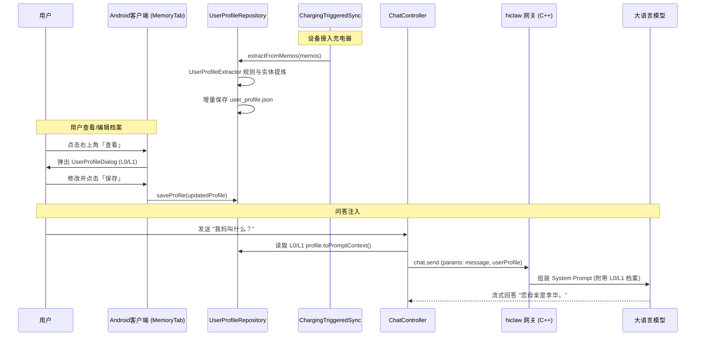

# Bonio 分层记忆架构（L0 ~ L3）与充电萃取产品设计方案 (PRD)

- **作者**：Bonio 架构与产品团队
- **日期**：2026-09-16
- **状态**：已实施 (Implemented)
- **关联文档**：
  - `docs/design/arch/20260910-memory-hierarchical-rag-and-charging-vectorization-arch.md`
  - `docs/design/prd/20260916-notification-memo-todo-prd.md`

---

## 1. 业务背景与问题定义

用户在使用 AI 伴侣时，常常有以下痛点与疑问：
1. **扁平记录缺乏结构化画像**：用户在日常使用中积累了许多 Memos（随手记、双击屏幕记忆、工作备忘），但系统仅将它们当作扁平的列表存储，大模型无法直接提炼出用户的姓名、家庭关系、常住地址等基础画像；
2. **问答缺乏用户背景感知**：当用户向 AI 询问诸如“我妈叫什么？”、“我常去的医院是哪个？”、“我今年多大了？”时，AI 无法快速准确作答，甚至产生幻觉；
3. **电量与算力平衡**：移动端如果在平时持续运行复杂的特征提取与语义分析，会导致发热和电池过度消耗；因此需要借助**设备充电（Charging）状态**作为黄金处理窗口。

---

## 2. 记忆系统分层架构定义 (L0 ~ L3)

本次重构确立了清晰的四层记忆架构：

| 层级 | 名称 | 特征与定义 | 示例数据 | 存储与加载机制 |
| :--- | :--- | :--- | :--- | :--- |
| **L0** | **基础固定信息** (Basic Fixed Info) | 稳定不变或长期固定的核心画像与身份事实 | 姓名、性别、年龄/生日、手机号 | 本地私有存储 `user_profile.json`，常驻内存，问答系统提示词全量注入 |
| **L1** | **长期稳定信息** (Long-term Stable Info) | 用户的核心社交关系、生活空间与长期职业事实 | 亲属/家属/亲朋好友（如“母亲: 李华”）、住址（“家: 杭州西湖区”）、职业身份（“软件架构师”）、长期生活习惯事实 | 本地存储与同步，问答系统提示词全量注入，支持用户在端侧直接编辑与修改 |
| **L2** | **动态偏好层** (Dynamic Preferences) | 用户近期的兴趣、关切点与行为偏好 | “最近在准备马拉松”、“近期喜好美式咖啡”、“在看二手房” | 定期会话聚类摘要，按时效衰减 |
| **L3** | **明细记录层** (Raw Memos & Logs) | 用户记录的原始日志与详细记忆明细 | 日常随手记、截屏剪藏、网页双击记忆、通知备忘等原始文本 | 服务端/本地 SQLite，支持全文检索 (FTS5) 与充电增量向量化 |

---

## 3. 核心功能与交互设计

### 3.1 记忆页右上角交互改造
- **隐藏“导出”功能**：暂不提供导出功能，界面不再展示“导出”按钮；
- **新增“查看”按钮**：原“导出”按钮位置替换为**“查看”**按钮，保留右侧的“导入”按钮；
- **用户基础档案面板 (`UserProfileDialog`)**：
  - 点击“查看”打开弹窗面板；
  - 顶部显示标题与说明：“分层记忆 L0 基础固定信息 & L1 长期稳定信息”；
  - **L0 基础固定信息**：姓名、性别、年龄/生日、手机号输入框；
  - **L1 长期稳定信息**：职业与身份、亲属与好友关系、常住地址与地点、长期事实备忘等输入框；
  - 底部操作：
    - **“从记忆提炼”**：手动一键触发从现有 Memos 中扫描并萃取；
    - **“保存”**：用户直接编辑修改后点击保存，即时持久化到本地安全目录；
    - 友好提示：“⚡ 手机充电时会自动从记忆与备忘中萃取提炼，在问答时自动注入大模型。”

### 3.2 充电智能萃取机制 (Charging Extraction)
- **触发源**：监听系统广播 `ACTION_POWER_CONNECTED` 及 `ACTION_BATTERY_CHANGED`；
- **调度策略**：接入电源且满足 5 分钟冷却期后，在后台协程中自动启动；
- **双模萃取算法**：
  - **规则抽取器 (`UserProfileExtractor`)**：支持常见中文句式的即时解析（无需网络与 Token），识别姓名、年龄、手机、亲友三元组、家庭与公司地址、职业身份等；
  - **大模型抽取**：在网关连接活跃时，对非结构化文本进行实体识别；
  - **保护合并策略 (`mergeProfiles`)**：
    - 用户手动在面板编辑过的值具有最高优先级，自动萃取不覆盖非空字段；
    - 多值列表（亲友、地址、事实）以分号自动去重合并；
    - 记录 `lastExtractedMemoTime`，避免重复扫描历史记录。

### 3.3 问答对话注入 (Chat Context Injection)
- 用户在聊天输入框发送消息时，前端界面气泡**仅展示用户真实输入的文本**，绝不被注入的系统上下文污染；
- 底层在组装 `chat.send` 请求时，动态带入结构化 `userProfile` 上下文；
- 服务端 `hiclaw` 网关将 `userProfile` 注入到大模型系统提示词（System Prompt）末尾的 `## User Background Knowledge (L0/L1 Profile)` 中；
- 大模型自然感知主人的姓名、家人、住址等基础画像，使问答具备人情味与精准度。

---

## 4. 技术实现与架构串联

---

## 5. 验证与交付标准

1. **编译通过**：
   - Server (`hiclaw`) C++17 macOS arm64 / Linux 编译通过；
   - Android Kotlin 编译并通过 `./gradlew assembleDebug`。
2. **测试验证**：
   - 包含 `UserProfileExtractionTest` 单元测试，覆盖 L0/L1 规则抽取、去重合并、保留手动编辑及提示词格式化，100% 通过。
3. **交互验证**：
   - Memory 页面右上角隐藏“导出”，展示“查看”与“导入”；
   - 点击“查看”弹出支持编辑与从记忆提炼的面板；
   - 充电状态触发萃取与合并。
