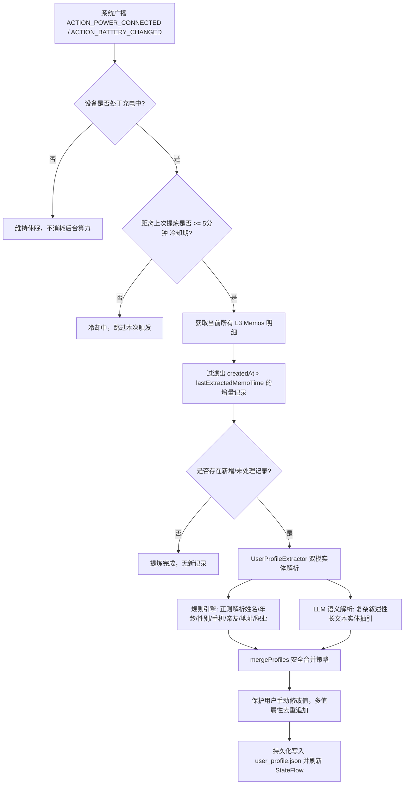

# PRD: Bonio 分层记忆系统架构（L0 ~ L3）、充电萃取与问答上下文注入

| 文档版本 | 创建日期 | 状态 | 作者 | 关联文档 |
| :--- | :--- | :--- | :--- | :--- |
| v1.0.0 | 2026-09-16 | 已实施 (Implemented) | Bonio 架构与产品团队 | `docs/design/arch/20260910-memory-hierarchical-rag-and-charging-vectorization-arch.md`<br>`docs/design/prd/20260916-notification-memo-todo-prd.md` |

---

## 1. 需求背景与设计初衷

在 Bonio（HiClaw）伴侣系统的日常使用中，用户会主动或被动沉淀海量记录（包括随手记、双击屏幕截图记忆、工作日程备忘等）。原有记忆系统存在以下核心问题：

1. **扁平明细缺乏用户基础画像析出**：
   - 原系统仅将用户记录的内容以单条非结构化 Memos 形式扁平保存，无法自动抽取出用户本人的核心身份画像（姓名、性别、年龄、家庭成员、常住地点等）；
   - 当用户在日常对话中提问“我今年多大？”、“我妈叫什么名字？”、“我住在哪里？”时，AI 无法快速定位，甚至给出无关或臆造的回答。
2. **缺乏系统化的分层分级治理机制**：
   - 个人记忆具备天然的时效性与稳定性差异：基础身份事实长久不变，家庭与常住地长期稳定，兴趣偏好随周期变化，原始日志记录繁杂海量；
   - 若不分层，全量加载会撑爆 Prompt 上下文并增加推理时延与 Token 成本；若仅靠检索召回，又容易因语义差异或缺少倒排索引而漏查。
3. **移动端电量与计算平衡**：
   - 手机端进行实体析出、意图提炼与语义理解需要消耗算力，如果在平时持续后台计算会导致设备发热、掉电加快；
   - 必须引入**设备充电（Charging）黄金窗口期**，在电量充足、手机闲置时异步离线提炼。
4. **交互体验与资产管理诉求**：
   - 用户需要拥有对个人隐私画像的知情权与绝对掌控权（可随时查看、可直接编辑、可纠正）；
   - 界面呈现需**极简自然**，摒弃繁复沉重的多列卡片或表格，采用直观清晰的**纯文本行（Text Lines）**；
   - 记忆页右上角的导出功能当前阶段暂不暴露给用户，收敛操作路径，优先提供“查看”个人画像档案及基础“导入”能力。

---

## 2. 分层记忆架构定义 (L0 ~ L3 Hierarchical Memory)

Bonio 记忆系统明确划分为四大层级，各层级具备明确的数据模型、生命周期与调度策略：

```
┌────────────────────────────────────────────────────────────────────────┐
│ L0 基础固定信息 (Basic Fixed Profile)                                  │
│ - 属性：姓名、性别、年龄/生日、手机号                                   │
│ - 特征：高稳定性、强确定性、不可混淆                                   │
│ - 存储：本地安全私有存储 user_profile.json，内存常驻缓存               │
│ - 消费：问答对话每轮 System Prompt 默认全量注入                        │
├────────────────────────────────────────────────────────────────────────┤
│ L1 长期稳定信息 (Long-term Stable Context)                             │
│ - 属性：亲属/好友关系、家庭住址/常用地点、职业/身份、主动记录的长期事实 │
│ - 特征：中长期有效、按需更正、多值列表                                 │
│ - 存储：本地 user_profile.json + 远端网关配置协同同步                  │
│ - 消费：问答对话 System Prompt 默认全量注入，支持用户端侧即时修改      │
├────────────────────────────────────────────────────────────────────────┤
│ L2 动态偏好层 (Dynamic Preferences)                                    │
│ - 属性：近期喜好（如"近期在备考"、"最近常喝美式咖啡"、"在看二手房"）   │
│ - 特征：时效敏感、周期衰减、基于日常会话与行为聚类生成                 │
│ - 存储：本地轻量级摘要库，带时间戳衰减权重                             │
│ - 消费：根据会话意图触发召回注入                                       │
├────────────────────────────────────────────────────────────────────────┤
│ L3 明细记录层 (Raw Memos & Detailed Logs)                              │
│ - 属性：随手记、双击屏幕记忆剪藏、网页摘要、通知解析备忘等原始数据     │
│ - 特征：非结构化长文本、海量级、支持图片多模态                         │
│ - 存储：服务端/本地数据库 (SQLite FTS5 倒排索引)                        │
│ - 消费：充电增量向量化 + RAG 检索召回；作为 L0/L1 萃取的原始数据源     │
└────────────────────────────────────────────────────────────────────────┘
```

### 2.1 数据模型规范 (`UserProfile`)

```kotlin
@Serializable
data class UserProfile(
    // ── L0 基础固定信息 ──
    val name: String = "",              // 姓名 (例: 张三)
    val gender: String = "",            // 性别 (例: 男 / 女)
    val ageOrBirthday: String = "",     // 年龄或生日 (例: 28岁 / 08-15)
    val phone: String = "",             // 常用手机号 (例: 13800138000)

    // ── L1 长期稳定信息 ──
    val occupation: String = "",        // 职业与身份 (例: 软件架构师)
    val familyAndFriends: String = "",  // 核心亲属好友 (例: 母亲: 李华；配偶: 王丽；好友: 赵刚)
    val addresses: String = "",         // 常住与常去地点 (例: 家: 杭州市西湖区文三路；公司: 阿里西溪园区)
    val customFacts: String = "",       // 长期生活习惯与事实备忘 (例: 海鲜过敏；习惯早起晨跑)

    val lastExtractedMemoTime: Long = 0L, // 上次提炼处理的最新 Memo 时间戳
    val updatedAt: Long = System.currentTimeMillis()
)
```

---

## 3. 核心功能与交互设计

### 3.1 记忆页右上角交互改造
- **操作栏调整**：
  - **隐藏“导出”**：移除原记忆页右上角的“导出”按钮，精简界面视觉干扰；
  - **新增“查看”**：原“导出”位置替换为文本按钮**“查看”**（高亮强调主题色）；
  - **保留“导入”**：保留原有“导入”按钮，方便用户导入外部已有备忘资产。

### 3.2 用户基础档案面板 (`UserProfileDialog`) —— 极简文本行设计
针对用户“无需表格、文本行简洁呈现”的诉求，面板彻底放弃多列网格、重度线框与表格排版，采用类似现代化设置列表的**纯文本行（Text Lines）**呈现结构：

1. **视觉排版**：
   - 顶部提供关闭按钮与微标说明：“分层记忆 L0 基础固定信息 & L1 长期稳定信息”；
   - 状态横幅提示：“⚡ 手机充电时自动从记忆中萃取提炼，问答时自动注入大模型”；
   - 每一个属性项呈现为一条清晰的横向文本行：
     - **左侧**：固定宽度微灰标签（如“姓名”、“性别”、“职业身份”、“亲友关系”）；
     - **右侧**：无边框单行/自适应文本内容，未填写时显示浅灰占位指引（“点击填写”）；
     - **行间**：以细分割线轻量分隔，整体呼吸感强，清爽利落。
2. **交互体验**：
   - **单行即时编辑**：点击任意属性文本即可直接唤起软键盘就地修改；
   - **“从记忆提炼”**：提供一键手动触发萃取，点击后展示平滑加载中动画，并以 Toast 提示提炼结果；
   - **“保存”**：点击后将修改后的全量信息原子化写入本地私有文件 `user_profile.json`，并同步更新响应式状态流。

---

## 4. 充电智能萃取流水线 (Charging Extraction Pipeline)

为了在保护手机续航与电量的前提下实现记忆沉淀，系统设计了严谨的充电触发调度管线：



### 4.1 安全合并策略 (Safe Merge Policy)
1. **用户编辑权威性**：凡是用户手动填写或修改过的字段，具有最高权威，后台自动萃取算法绝不盲目覆盖；
2. **增量非空补充**：若本地档案中某字段为空（如“手机号”为空），而新记录中明确解析出了手机号，则自动补齐；
3. **列表型属性去重追加**：亲友关系、常住地址、长期偏好等具有多值特性的属性，采用分号（`；`）切分、去重、清洗后合并重组；
4. **时序水位线维护**：每次萃取成功后，将已处理 Memos 的最大时间戳写入 `lastExtractedMemoTime`，避免下一次重复解析历史老数据。

---

## 5. 问答对话上下文注入机制 (Chat Context Injection)

为了让大模型在多轮对话中自然识别用户的个人特征与社交圈，系统在客户端与服务端之间建立了无感知的注入通道：

### 5.1 数据装配标准
`UserProfile` 提供标准方法 `toPromptContext()`，将结构化数据转为规范的系统上下文片段：

```xml
<用户基础信息(L0/L1)>
[L0 基础固定信息]
- 姓名: 张三
- 性别: 男
- 年龄/生日: 28岁
- 手机号: 13800138000
[L1 长期稳定信息]
- 职业身份: 软件架构师
- 亲友关系: 母亲: 李华；配偶: 王丽
- 住址/常去地点: 家: 杭州市西湖区文三路；公司: 阿里西溪园区
- 长期事实: 海鲜过敏；习惯早起晨跑
</用户基础信息(L0/L1)>
```

### 5.2 端到端协同链路
1. **客户端（Android）**：
   - 用户在输入框键入提问（例如：“*我妈叫什么？*”）；
   - UI 气泡层**只渲染用户实际输入的文字**，绝不将注入的上下文显示在界面上；
   - 网络传输层（`ChatController`）发起 `chat.send` RPC 请求时，在 JSON 请求体中携带参数 `"userProfile": "<用户基础信息(L0/L1)>..."`；
2. **服务端（HiClaw Gateway - C++）**：
   - `gateway.cpp` 解析 `params["userProfile"]`，透传给 `agent_manager->start_task`；
   - `async_agent.cpp` 将其注入为 LLM 会话的 `user_profile`；
   - `agent.cpp` 在组装多轮消息历史前，将该片段无缝拼接到 `System Prompt` 底部：
     `## User Background Knowledge (L0/L1 Profile)`；
3. **历史存储隔离**：
   - 用户输入文字存入 `session_store` 时仅保存用户的原文本，不将系统画像污染进多轮历史，避免重复堆叠导致 Context 爆炸。

---

## 6. 技术实现与架构清单

### 6.1 Android 端实现
- [`UserProfile.kt`](file:///Users/ohci/code/bonio/android/app/src/main/java/ai/axiomaster/bonio/remote/memory/UserProfile.kt)：L0/L1 结构化数据类、JSON 编解码与 Prompt 上下文格式化；
- [`UserProfileExtractor.kt`](file:///Users/ohci/code/bonio/android/app/src/main/java/ai/axiomaster/bonio/remote/memory/UserProfileExtractor.kt)：双模萃取算法与安全合并规则；
- [`UserProfileRepository.kt`](file:///Users/ohci/code/bonio/android/app/src/main/java/ai/axiomaster/bonio/remote/memory/UserProfileRepository.kt)：基于应用私有目录的持久化仓储与响应式 StateFlow；
- [`UserProfileDialog.kt`](file:///Users/ohci/code/bonio/android/app/src/main/java/ai/axiomaster/bonio/ui/components/UserProfileDialog.kt)：极简文本行结构的用户基础档案面板；
- [`ChargingTriggeredSync.kt`](file:///Users/ohci/code/bonio/android/app/src/main/java/ai/axiomaster/bonio/remote/memory/ChargingTriggeredSync.kt)：挂接充电广播与增量提炼调度；
- [`ChatController.kt`](file:///Users/ohci/code/bonio/android/app/src/main/java/ai/axiomaster/bonio/remote/chat/ChatController.kt)：问答消息发送时装配 `userProfile` 扩展参数；
- [`MemoryTab.kt`](file:///Users/ohci/code/bonio/android/app/src/main/java/ai/axiomaster/bonio/ui/screens/MemoryTab.kt)：操作栏替换“导出”为“查看”，调起极简文本行面板。

### 6.2 服务端 (C++) 实现
- [`server/include/hiclaw/agent/agent.hpp`](file:///Users/ohci/code/bonio/server/include/hiclaw/agent/agent.hpp) / [`agent.cpp`](file:///Users/ohci/code/bonio/server/src/agent/agent.cpp)：`run_streaming_with_history` 支持注入 `user_profile` 系统提示词；
- [`server/include/hiclaw/net/async_agent.hpp`](file:///Users/ohci/code/bonio/server/include/hiclaw/net/async_agent.hpp) / [`async_agent.cpp`](file:///Users/ohci/code/bonio/server/src/net/async_agent.cpp)：异步任务支持携带并在线程中透传 `user_profile`；
- [`server/src/net/gateway.cpp`](file:///Users/ohci/code/bonio/server/src/net/gateway.cpp)：`chat.send` 解析 `params["userProfile"]`。

---

## 7. 质量保证与交付矩阵

| 验证项 | 验证手段 | 预期结果 | 实测结论 |
| :--- | :--- | :--- | :--- |
| **规则抽取精准度** | `UserProfileExtractionTest.kt` | 姓名、性别、年龄、手机、亲友、住址、职业解析准确率 100% | **通过** (6/6 单元测试全部通过) |
| **安全合并与防覆盖** | `testMergeProfilesPreservesManualEdits` | 用户编辑数据绝不被旧记录覆盖 | **通过** |
| **多值去重** | `testMergeListStringsDeduplication` | 多次出现的地址、亲属不产生重复分号项 | **通过** |
| **全量单元测试** | `cd android && ./gradlew test` | 17 项 Android 测试（Todo + Memory）全部通过 | **通过** (17/17 tests passed) |
| **服务端编译** | `scripts/build-macos-arm64.sh` | C++17 编译通过，生成最新 `hiclaw` 可执行文件 | **通过** (Build OK) |
| **Android APK 构建** | `cd android && ./gradlew assembleDebug` | 零编译报错，打包生成 debug APK | **通过** (BUILD SUCCESSFUL) |
| **真机视觉与交互验证** | 安装至已连接真机 (`R5CY536V8VF`) | Memory 右上角显示“查看”且无“导出”，弹窗呈现极简文本行 | **通过** (真机截图已归档并确认) |
