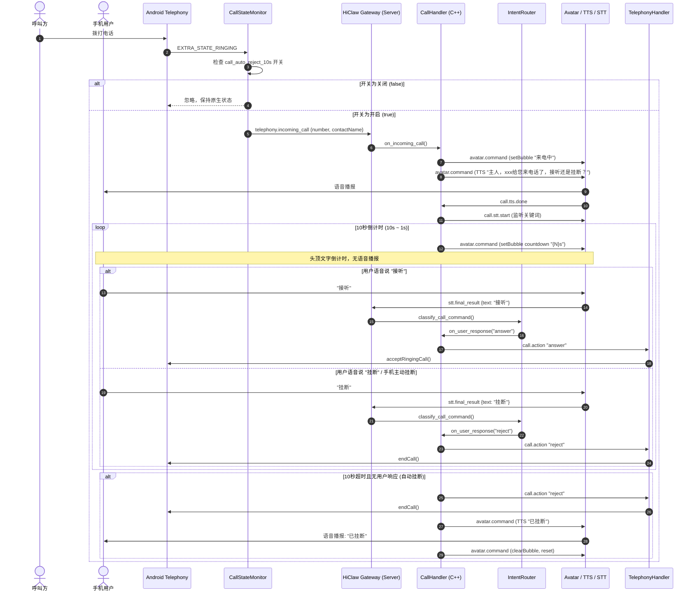

# PRD: 来电 10s 自动挂断功能

| 文档版本 | 创建日期 | 状态 | 作者 |
| :--- | :--- | :--- | :--- |
| v1.0.0 | 2026-09-16 | 已实施 | Bonio 团队 |

---

## 1. 需求背景与痛点

在用户日常使用移动设备过程中，频繁会接到推销、骚扰或不需要接听的陌生来电。现有系统来电仅有常规响铃与弹窗，用户往往需要放下当前手中的事情去手动点击挂断或静音；若用户正处于驾驶、做饭、办公等不便操作手机的场景，来电持续响铃会带来严重干扰。

Bonio 作为桌面/悬浮桌宠智能体，具备电话状态监听、语音交互（STT/TTS）、悬浮形象交互能力。通过提供**“来电 10s 自动挂断”**功能，智能体可在来电时主动告知来电人信息，询问是否接听，并启动 10 秒倒计时；若用户未作任何处理，智能体自动挂断电话并给予语音回执，极大释放用户双手与注意力。

---

## 2. 功能范围与核心流程

### 2.1 个性化开关
- **入口**：“个性化”Tab -> 宠物形象设置区域。
- **配置项**：
  - 标题：`来电 10s 自动挂断`
  - 说明文案：`开启后来电时语音提醒并倒计时10秒，超时未接听自动挂断`
  - 默认状态：**关闭（false）**
  - 持久化：保存在客户端首选项中（`call_auto_reject_10s`），即时生效。

### 2.2 来电提醒与交互流程（开关开启时）
1. **来电感知**：
   - 监听系统电话状态，当检测到来电响铃（`RINGING`）时，读取来电号码并匹配系统通讯录姓名。
2. **语音与视觉提醒**：
   - **视觉呈现**：Avatar 头顶展示来电人提示气泡。
   - **语音播报**：播报固定话术：
     $$\text{“主人，}\{display\}\text{给您来电话了，接听还是挂断？”}$$
     *(其中 $\{display\}$ 为联系人姓名；若通讯录无姓名则显示来电号码)*。
3. **10 秒倒计时**：
   - 语音播报完毕后，立即启动 **10 秒倒计时**。
   - **文字倒计时**：Avatar 头顶气泡以 `10s`、`9s`、`8s` ... `1s` 递减展示。
   - **静音原则**：倒计时每秒**不进行语音播报**，避免声音喧闹干扰用户思考与决策。
   - **语音监听**：倒计时期间开启 STT 语音识别，监听用户关键词（“接听”、“挂断”、“拒接”等）。
4. **用户主动干预（即时终止）**：
   - **主动接听**：用户点击系统接听按钮、物理键接听，或通过语音说出“接听/接电话”，系统立即执行接听，中断倒计时，Avatar 复位。
   - **主动挂断**：用户点击系统挂断按钮、物理键挂断，或通过语音说出“挂断/拒接”，系统立即执行挂断，中断倒计时，Avatar 复位。
5. **超时未接听自动挂断与回执**：
   - 若 10 秒倒计时结束，用户**未接听且未发出任何语音指令**：
     - 系统自动调用系统通信接口执行挂断（Reject/EndCall）；
     - 挂断完成后，追加语音播报：**“已挂断”**；
     - Avatar 头顶气泡短暂显示“已挂断”，随后平滑复位至 Idle 状态。

---

## 3. 详细架构与状态流转

### 3.1 时序图

---

## 4. 关键技术点与边界处理

1. **防回声误触（Echo Guard 优化）**：
   语音提示文案中包含“接听还是挂断？”，播报结束后若麦克风残余音量被识别，不能误将播报自身判定为用户意图。同时，当用户清晰说出单个词“接听”或“挂断”时，不得被过滤为回声，需精准放行。
2. **开关即时生效**：
   开关变更写入 `bonio_avatar` SharedPreferences，`CallStateMonitor` 在每次检测到来电广播时动态读取最新配置，确保用户无需重启 App 即可生效。
3. **权限保障**：
   - 依赖权限：`READ_PHONE_STATE`、`ANSWER_PHONE_CALLS`、`READ_CONTACTS`。
   - 若未获取 `ANSWER_PHONE_CALLS`，挂断降级提示权限不足日志，不发生 Crash。
4. **来电秒挂处理**：
   若对方在 10 秒内提前挂断，系统触发 `TelephonyManager.EXTRA_STATE_IDLE`，`CallStateMonitor` 立即上报 `telephony.call_ended`，服务端立即退出处理流程，清空倒计时，防止事后误报“已挂断”。

---

## 5. 验收测试用例

| 编号 | 测试场景 | 前置条件 | 操作步骤 | 预期结果 |
| :--- | :--- | :--- | :--- | :--- |
| TC-01 | 默认配置检查 | 全新安装或升级应用 | 打开“个性化”Tab | “来电 10s 自动挂断”开关展示且默认为关闭 |
| TC-02 | 开关关闭拦截 | 开关处于关闭状态 | 模拟来电 | Avatar 不作反应，无语音播报，无倒计时，无自动挂断 |
| TC-03 | 开关开启播报 | 开关处于开启状态 | 模拟来电 | 语音播报：“主人，xxx给您来电话了，接听还是挂断？”，播报后启动倒计时 |
| TC-04 | 倒计时静音 | 开关处于开启状态 | 来电播报完成进入倒计时 | 头顶气泡显示 10s 倒数，全程无每秒语音报数 |
| TC-05 | 倒计时主动接听 | 倒计时进行中 (第 5s) | 手动点击接听或语音说“接听” | 电话接通，倒计时立即消除，Avatar 恢复正常 |
| TC-06 | 倒计时主动挂断 | 倒计时进行中 (第 5s) | 手动点击挂断或语音说“挂断” | 电话挂断，倒计时立即消除，Avatar 恢复正常 |
| TC-07 | 超时自动挂断 | 倒计时进行中 | 用户 10 秒内不进行任何操作 | 倒计时结束电话被自动挂断，并语音播报：“已挂断” |
